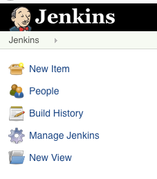
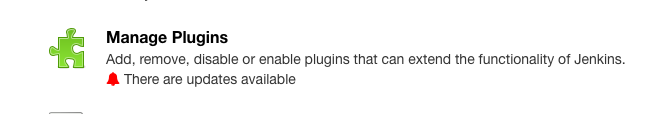
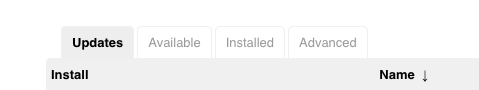
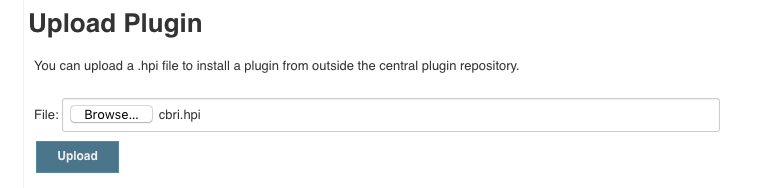
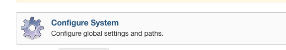
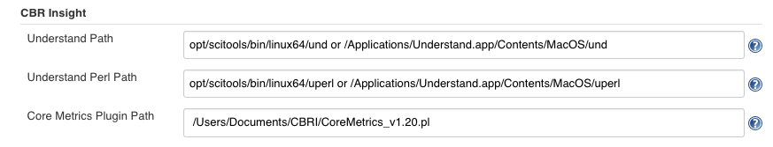
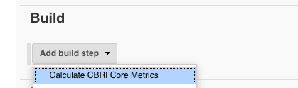
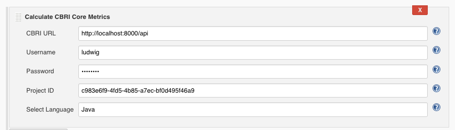

# CBRI-Plugin
A Jenkins plugin that will analyze source with Understand, calculate core metrics, and then post the results to the CBRI REST API.

Note: The CBRI Plugin requires a licensed copy of the 
Understand software. Trial licenses are available from 
[SciTools](https://scitools.com/).

## Test
To test from the source code, run: `mvn hpi:run`

And then browse to: [http://localhost:8080/jenkins/](http://localhost:8080/jenkins/)

## Build
To build the plugin from source, run: `mvn install`

This will create the file **./target/cbri.hpi** that you can deploy to Jenkins.

## Install
1. Navigate to **Manage Jenkins**.

2. Scroll down and select **Manage Plugins**.

3. Select the **Advanced** tab.

4. **Browse** to the cbri.hpi file and then **Upload**

5. Perform the Global and Project Configurations.

## Global Configuration
1. Navigate to **Manage Jenkins** (see Installation).
2. Scroll down and select **Configure System**.

3. Scroll down to **CBR Insight*** and fill out the three paths and **Save**.

The first line is the path for 'und', 
the second for 'uperl',
and the third is for the Core Metrics perl plugin.

## Project Configuration
1. In the project's **Build** section, add the 
**Calculate CBRI Core Metrics** build step.

2. Fill out the five required sections of the build step.

The first three lines are the CBRI REST API URL, username, and password.
This allows the plugin to login to the REST API.

The fourth line is the unique ID of the project, 
which can be found by viewing the project in the CBRI web application.

The fifth line is the language of the project.

